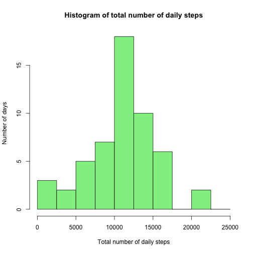

# Reproducible Research: Peer Assessment 1
## Loading and preprocessing the data. 
### First unzip activity.zip file and do some basic data exploration.

```r
unzip("activity.zip")
library(dplyr)
```

```
## 
## Attaching package: 'dplyr'
## 
## The following object is masked from 'package:stats':
## 
##     filter
## 
## The following objects are masked from 'package:base':
## 
##     intersect, setdiff, setequal, union
```

```r
library(lattice)
data=read.csv2("activity.csv",sep=",",header=TRUE)
head(data)
```

```
##   steps       date interval
## 1    NA 2012-10-01        0
## 2    NA 2012-10-01        5
## 3    NA 2012-10-01       10
## 4    NA 2012-10-01       15
## 5    NA 2012-10-01       20
## 6    NA 2012-10-01       25
```

```r
names(data)
```

```
## [1] "steps"    "date"     "interval"
```

```r
dim(data)
```

```
## [1] 17568     3
```

## What is mean and median total number of steps taken per day?
#### For this part of the assignment, you can ignore the missing values in the dataset. Make a histogram of the total number of steps taken each day.Calculate and report the mean and median total number of steps taken per day


```r
daily_step_totals=sapply(split(data$steps,data$date),sum)
hist(daily_step_totals,breaks=c(seq(0,25000,2500)),xlab="Total number of daily steps",ylab="Number of days",main="Histogram of total number of daily steps",col="lightgreen")
```

 

```r
mean_daily_steps=mean(daily_step_totals,na.rm=TRUE)
median_daily_steps=median(daily_step_totals,na.rm=TRUE)
cat(paste("Mean Daily Steps:", mean_daily_steps ))
```

Mean Daily Steps: 10766.1886792453

```r
cat(paste("Median Daily Steps:", median_daily_steps ))    
```

Median Daily Steps: 10765


## What is the average daily activity pattern?


```r
avg_daily_pattern=sapply(split(data$steps,data$interval),mean,na.rm=TRUE)
aa=1:288
avg_daily_df=as.data.frame(cbind(aa,avg_daily_pattern))
names(avg_daily_df)=c("id","avg_daily_pattern")
xyplot(avg_daily_pattern ~ id, data =avg_daily_df ,  type = "l",xlab="interval count",ylab="average num of daily steps")
```

 

```r
hours=data$interval %/% 100
minutes=data$interval %% 60

avg_daily_pattern[avg_daily_pattern==max(avg_daily_pattern)]
```

```
##      835 
## 206.1698
```
#### The activity peaks at interval 104 which corresponds to the time interval between 8:30-8:35am. As would be expected, activity level drops after 10 pm and does not pick up till 6 am. 

## Imputing missing values.


```r
tot_num_of_missing_values=sum(is.na(data))
cat(paste("Total number of missing values:",tot_num_of_missing_values  ))    
```

Total number of missing values: 2304
#### Simplest case: Impute missing values with average for that interval.Do this using if else and select and regenerating a histogram for the new dataset.


```r
means_vec=means_vec=as.vector(avg_daily_pattern)
int_vec= as.numeric(levels(as.factor(data$interval)) )
data$updated_steps=ifelse((is.na(data$steps)),means_vec[match(data$interval,int_vec)],data$steps)
updated_data=select(data,-steps)
aa=group_by(updated_data,date)
updated_stepsSum=summarize(aa,daily_tot=sum(updated_steps))
hist(updated_stepsSum$daily_tot,breaks=c(seq(0,25000,2500)),xlab="Total number of daily steps",ylab="Number of days",main="Histogram of total number of daily steps",col="lightblue")
```

 

```r
data=select(data,-steps)
imputed_mean_daily_steps=mean(updated_stepsSum$daily_tot,na.rm=TRUE)
imputed_median_daily_steps=median(updated_stepsSum$daily_tot,na.rm=TRUE)
cat(paste("Mean Daily Steps:", imputed_mean_daily_steps ))
```

Mean Daily Steps: 10766.1886792453

```r
cat(paste("Median Daily Steps:", imputed_median_daily_steps ))    
```

Median Daily Steps: 10766.1886792453
#### There is no difference in the mean number of steps before and after imputing -which makes sense as I imputed the missing steps values with the average number of steps for that interval. There is a slight uptick in the median number of steps and now the median number of steps =mean number of daily steps.  

## Are there differences in activity patterns between weekdays and weekends?
#### Note: we are using the data with imputed values. First get the days of the week and then get the factor in numeric form.

```r
#data$day=weekdays(as.Date(data$date))
data$day_numeric=as.POSIXlt(data$date)$wday
data=data %>% mutate(day_factor=ifelse(day_numeric==0 | day_numeric==6,1,2))
weekend_data=filter(data,day_factor==1)
weekday_data=filter(data,day_factor==2)
weekday_avg_daily_pattern=sapply(split(weekday_data$updated_steps,weekday_data$interval),mean,na.rm=TRUE)
weekend_avg_daily_pattern=sapply(split(weekend_data$updated_steps,weekend_data$interval),mean,na.rm=TRUE)
a=1:288
combine=as.data.frame(cbind(a,as.vector(weekday_avg_daily_pattern),as.vector(weekend_avg_daily_pattern)))
names(combine)=c("id","weekday","weekend")
xyplot(weekday + weekend ~ id, data = combine, layout = c(1,2), type = "l",xlab="interval count",ylab="average num of daily steps", outer = TRUE)
```

 
#### There are slight differnces in the activity pattern between weekday and weekends. The morning peak activity time has higher number of steps on weekends that weekdays. The overall activity during the day (apart from the mornign hrs) is more during weekdays than weekends.
